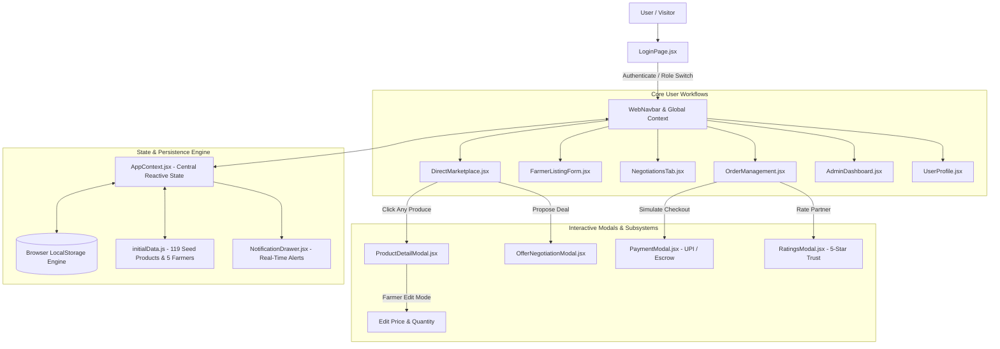

# 🌾 KisanDirect — Direct Market Access Web Portal for Farmers

[](https://react.dev/)
[](https://vitejs.dev/)
[](LICENSE)
[]()

> **KisanDirect is a modern agricultural web platform designed to eliminate middlemen, prevent farm-gate exploitation, and connect local farmers directly with bulk wholesale buyers and consumers through transparent price discovery, live negotiation, and simulated escrow settlements.**

---

## 📑 Table of Contents
- [The Problem Statement](#-the-problem-statement)
- [System Architecture](#-system-architecture)
- [End-to-End Platform Workflow](#-end-to-end-platform-workflow)
- [Key Features](#-key-features)
- [Verified Agricultural Catalogue (119 Products)](#-verified-agricultural-catalogue-119-products)
- [User Personas & Demo Credentials](#-user-personas--demo-credentials)
- [Technology Stack](#-technology-stack)
- [Local Development & Setup](#-local-development--setup)
- [Project Directory Structure](#-project-directory-structure)

---

## 🚨 The Problem Statement

In conventional agricultural marketing (APMC Mandis and informal farm-gate networks), farmers suffer from severe information asymmetry:
- **Middleman Commission Drain**: Intermediaries (commission agents, brokers, village aggregators) capture **25% to 45%** of the retail value.
- **Delayed & Non-Guaranteed Payments**: Farmers often wait weeks or months for payments with zero default protection.
- **Opaque Quality Deductions**: Subjective grading by buyers leads to arbitrary price slashes at Mandi yards.
- **Logistical Inefficiencies**: Empty truck deadheading and distress selling of perishable produce due to lack of buyer reach.

### 💡 The Solution: KisanDirect
KisanDirect creates an open, disintermediated digital marketplace:
1. **100% Direct Margins**: Farmers set their own prices benchmarked against live APMC Mandi rates.
2. **Built-in Escrow Security**: Funds are locked upon order placement and released only when the farmer generates a 4-digit pickup/delivery OTP upon quality satisfaction.
3. **Transparent Negotiation**: Interactive offer/counter-offer engine replacing one-sided broker price dictates.
4. **GPS Proximity Matching**: Farmers and buyers discover each other within customizable transit radii (10–500 km).

---

## 🏛 System Architecture

The following diagram illustrates the component architecture and data flow across KisanDirect:



---

## 🔄 End-to-End Platform Workflow

KisanDirect implements a structured **14-step agricultural lifecycle**:

```
[1. Registration/Login] ──> [2. Crop Listing] ──> [3. GPS Discovery] ──> [4. Total Crop Details]
                                                                                     │
[8. Confirmed Order] <── [7. Accept/Counter] <── [6. Live Negotiation] <── [5. Make Offer]
         │
         ▼
[9. Escrow UPI Payment] ──> [10. Dispatch/Transit] ──> [11. 4-Digit OTP Verification]
                                                                     │
[14. APMC Audit & KYC] <── [13. Mutual Trust Ratings] <── [12. Escrow Release to Farmer]
```

1. **User Authentication**: Dedicated login portal with 1-click verified persona sign-ins and registration for **Farmers**, **Wholesale Buyers**, and **Direct Consumers**.
2. **Farmer Product Listing**: Farmers input crop details, grade, expected price, harvest date, shelf-life, and high-resolution photo presets.
3. **Direct Marketplace**: Real-time listing feed displaying distance in kilometers, quality grades, and avoided broker fees.
4. **Product Details & Farmer Price Dictation**: Buyers inspect complete agronomic metrics (brix, moisture, certifications); farmers can toggle into edit mode to update prices and stock at will.
5. **Offer Submission**: Buyers propose custom volumes and price per kilogram.
6. **Negotiation Engine**: Counter-offers are exchanged transparently with history logs and custom notes.
7. **Agreement**: Once mutually agreed, the contract converts into a legally binding order.
8. **Escrow Funding**: Buyer deposits funds via simulated UPI (GPay, PhonePe, Paytm, BHIM). Money is held safely in escrow.
9. **Logistics & Readiness**: Farmer packages produce and marks status as `Ready for Pickup` or `Dispatched`.
10. **Delivery Handover**: 4-digit cryptographically generated OTP is shared with the buyer/driver.
11. **Inspection & OTP Release**: Buyer verifies produce quality and provides the OTP.
12. **Instant Fund Disbursement**: 100% of order value is transferred to the farmer's account with ₹0 middleman cut.
13. **Mutual 5-Star Reputation**: Both parties rate each other on freshness, payment speed, and punctuality.
14. **APMC Compliance & Moderation**: Mandi authorities verify KYC credentials, inspect listings, and track regional trading volumes.

---

## ⭐ Key Features

- **🌾 Massive 119-Product Seed Inventory**: 20+ products populated across every core agricultural category (Vegetables, Fruits, Grains, Pulses, Spices).
- **📍 GPS Proximity Distance Engine**: Uses the mathematical **Haversine formula** to calculate precise distances between farm coordinates and buyer locations in real time.
- **💰 Platform Savings Calculator**: Displays live aggregate middleman cuts saved across all transactions.
- **🛡️ Full Escrow Lifecycle**: Zero chance of payment default for farmers or substandard deliveries for buyers.
- **🏛️ APMC Regulatory Dashboard**: Government-grade administrative oversight with KYC toggles and listing management.
- **📱 Responsive Desktop & Tablet Web Design**: Built with modern CSS design tokens, sticky navigation, accessible modals, and micro-interactions.

---

## 🌾 Verified Agricultural Catalogue (119 Products)

Every category contains **at least 20+ rich items** with APMC benchmark comparisons, shelf-life days, and moisture/brix ratings:

| Category | Count | Sample Crops |
| :--- | :---: | :--- |
| 🥦 **Vegetables** | **24 items** | Nashik Red Onions, Vine Tomatoes, Garlic, English Cucumbers, Purple Cabbage, Cauliflower, Baby Spinach, Green Zucchini, Bitter Gourd, Lauki |
| 🍎 **Fruits** | **23 items** | Ratnagiri Alphonso Mangoes, Gala Red Apples, Bhagwa Pomegranates, Sharad Black Grapes, Honey Jackfruit, Barhi Fresh Dates, Strawberries, Mosambi |
| 🌾 **Grains** | **22 items** | Organic Sharbati Wheat, 1121 Pusa Basmati, Sona Masoori, Kolam Rice, Gandhakasala Fragrant Rice, Foxtail, Barnyard, Kodo, Little & Brown Top Millets, Khapli Wheat |
| 🥣 **Pulses** | **22 items** | Kashmiri Chitra Rajma, Jumbo Dollar Chana, Red Masoor, Orange Masoor Dal, White Urad Dal, Chilka Moong Dal, Moth Beans, Horse Gram, Lobia, Non-GMO Soybeans |
| 🌶️ **Spices** | **28 items** | Guntur S17 Teja Chillies, Tellicherry Black Pepper, Alleppey Cardamom, Pure Turmeric, Byadgi Chillies, Nagaur Cumin, Vanilla Pods, A2 Vedic Bilona Ghee |

---

## 👥 User Personas & Demo Credentials

Switch between pre-configured regional personas instantly via the **Web Navbar Switcher** or the **Login Page**:

| Persona | Name | Role | Region | Specialty |
| :--- | :--- | :--- | :--- | :--- |
| 🌾 Farmer | **Ramesh Kisan Kumar** | Farmer | Nashik, MH | Export Onions, Vine Tomatoes, Grapes |
| 🌾 Farmer | **Sardar Balwinder Singh** | Farmer | Ludhiana, PB | Sharbati Wheat, 1121 Basmati, Apples |
| 🌾 Farmer | **Venkat Raman Reddy** | Farmer | Guntur, AP | Teja Chillies, Turmeric, Sona Masoori |
| 🌾 Farmer | **Murugan Chettiar** | Farmer | Wayanad, KL | Tellicherry Pepper, Cardamom, Vanilla |
| 🌾 Farmer | **Bhanwar Lal Choudhary** | Farmer | Nagaur, RJ | Nagaur Cumin, Desi Chana, A2 Bilona Ghee |
| 🏢 Buyer | **Apex Agri Wholesalers** | Wholesale Buyer | Mumbai, MH | Bulk HORECA & Retail Procurement |
| 🛒 Consumer | **Priya Sharma** | Consumer | Mumbai, MH | Direct Farm-to-Table Community Buyer |
| 🏛️ Admin | **Dr. Arvind Swaminathan** | APMC Admin | State Board | Chief Agricultural Marketing Officer |

---

## 🛠 Technology Stack

- **Core Engine**: [React 19](https://react.dev/) + [Vite 8](https://vitejs.dev/)
- **Styling Architecture**: Vanilla CSS with comprehensive design token variables (`--color-primary`, `--font-heading`, `--shadow-md`)
- **Iconography**: [Lucide React](https://lucide.dev/)
- **Micro-Delight Animations**: [Canvas Confetti](https://www.npmjs.com/package/canvas-confetti)
- **Data Layer**: Centralized state management via `AppContext` with auto-merging `localStorage` persistence

---

## 🚀 Local Development & Setup

### 1. Clone the repository
```bash
git clone https://github.com/udaykumarreddy07/KisanDirect.git
cd KisanDirect
```

### 2. Install dependencies
```bash
npm install
```

### 3. Start development server
```bash
npm run dev
```
Open your browser and navigate to `http://localhost:5173`.

### 4. Build for production
```bash
npm run build
```

---

## 📁 Project Directory Structure

```
Farmer/
├── public/
│   └── icons.svg
├── src/
│   ├── assets/
│   ├── components/
│   │   ├── AdminDashboard.jsx        # APMC compliance, KYC verification & analytics
│   │   ├── DirectMarketplace.jsx     # Produce discovery grid, GPS radius & farmer filter
│   │   ├── FarmerListingForm.jsx     # Produce creation form with image presets
│   │   ├── LoginPage.jsx             # Multi-role authentication & 1-click demo sign-ins
│   │   ├── NegotiationsTab.jsx       # Counter-offer timeline & deal finalization
│   │   ├── NotificationDrawer.jsx    # Real-time event notifications & badges
│   │   ├── OfferNegotiationModal.jsx # Negotiation offer creation modal
│   │   ├── OrderManagement.jsx       # Order lifecycle tracker & 4-digit OTP verification
│   │   ├── PaymentModal.jsx          # Simulated UPI apps & escrow breakdown
│   │   ├── ProductDetailModal.jsx    # Full produce details & farmer price edit mode
│   │   ├── RatingsModal.jsx          # Mutual 5-star trust rating modal
│   │   ├── UserProfile.jsx           # Account management & Kisan Card credentials
│   │   ├── WebFooter.jsx             # Platform mission & footer links
│   │   └── WebNavbar.jsx             # Sticky navigation, persona switcher & live ticker
│   ├── context/
│   │   └── AppContext.jsx            # Central state, actions & localStorage persistence
│   ├── data/
│   │   └── initialData.js            # 119 verified products, APMC benchmarks & profiles
│   ├── utils/
│   │   └── helpers.js                # Haversine distance, currency formatting & OTP generators
│   ├── App.jsx                       # Root routing between LoginPage & WebPortal
│   ├── index.css                     # Design system tokens, buttons, cards & themes
│   └── main.jsx                      # Vite React entrypoint
├── index.html
├── package.json
├── vite.config.js
└── README.md
```

---

## 📄 License
This project is licensed under the MIT License — feel free to use, modify, and distribute for agricultural development and academic research.
